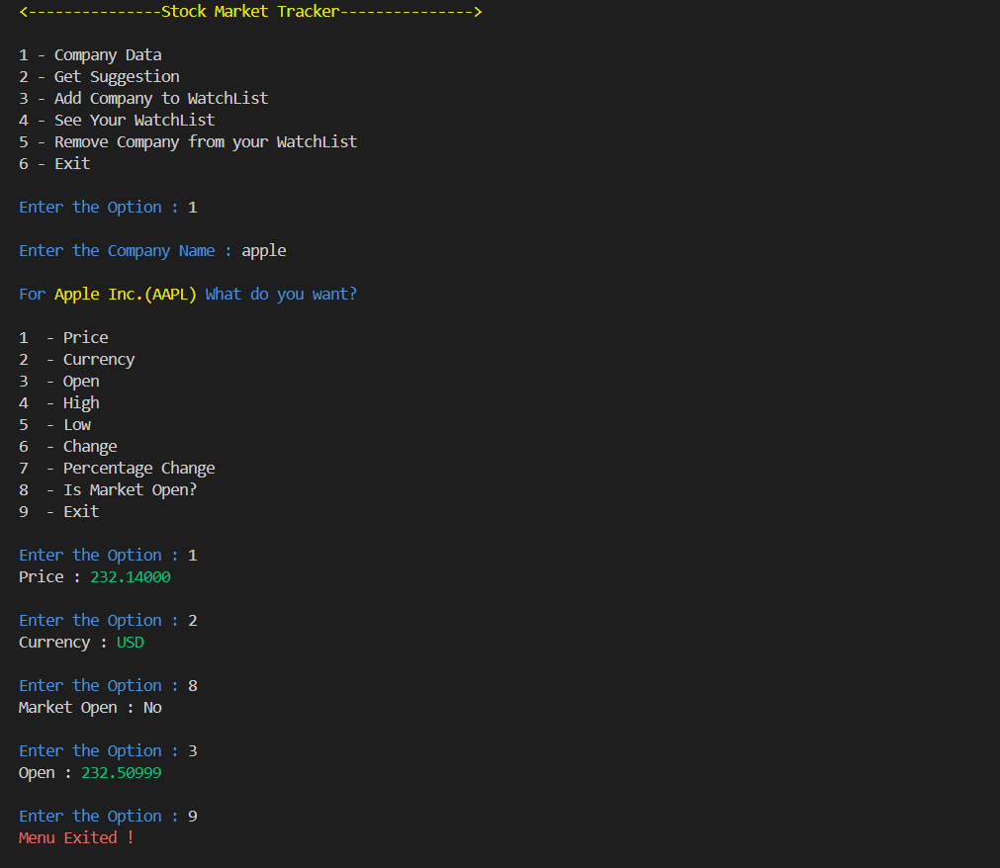
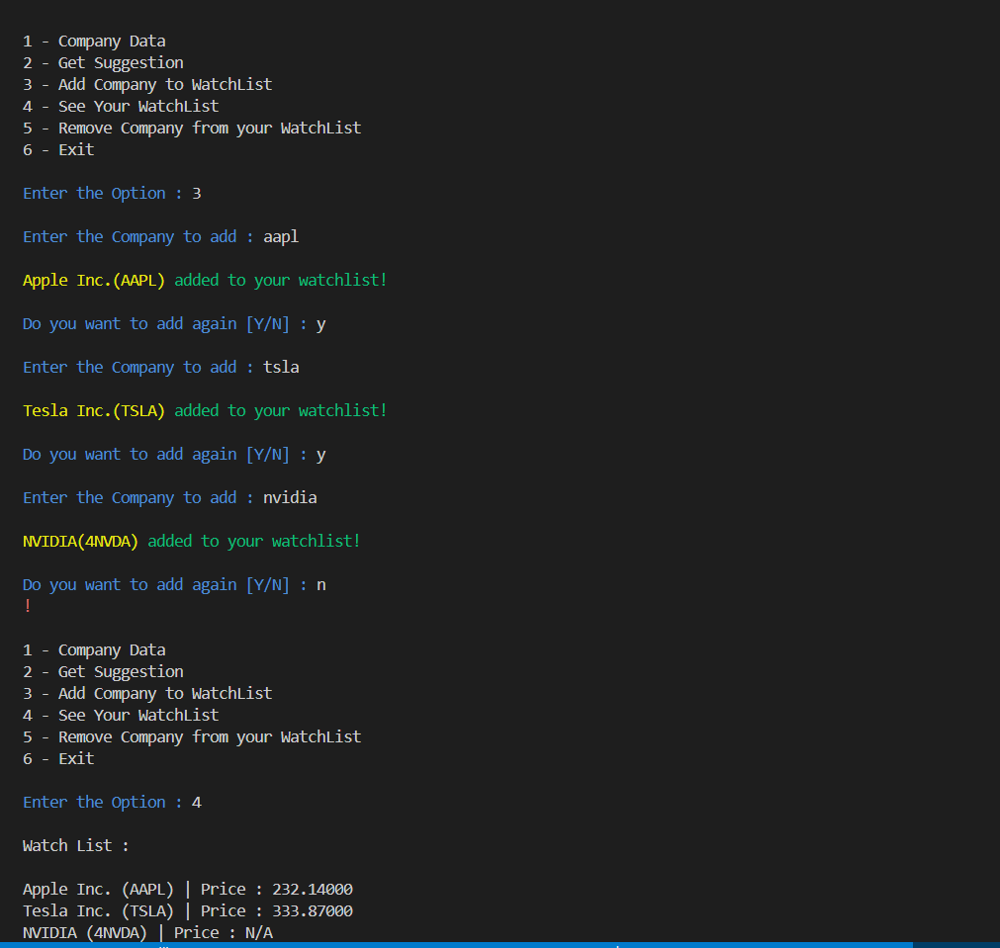
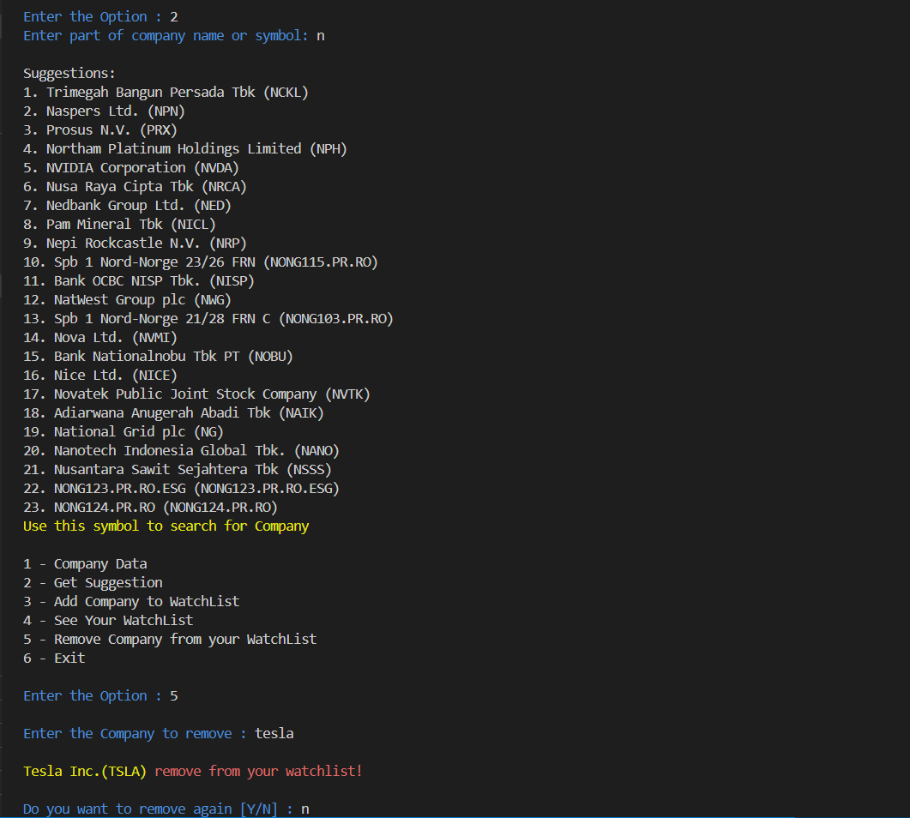

📈 Stock Market Tracker (Java Console App)

A Java-based console application that allows users to track stock market data in real-time using the Twelve Data API.
With this tool, you can fetch stock prices, manage a personalized watchlist, and get suggestions for company symbols.

🚀 Features :

🔎 Search Company Data by name or symbol
📊 View stock details (Price, Open, High, Low, Currency, Change, Percentage Change, Market Status)
💡 Get symbol suggestions for partial company names
📌 Add companies to a Watchlist
👀 View your Watchlist with live prices
❌ Remove companies from your Watchlist
🎨 Colored console output for better readability

🛠️ Tech Stack :

Java (Core Java, OOP Concepts)
Twelve Data API for real-time stock data
Console-based UI

📂 Project Structure

src/
├── ApiKey.java          # Stores API key
├── Colors.java          # ANSI color codes for console styling
├── ContentUrl.java      # Handles API URL generation and data parsing
├── FetchAndExtract.java # Fetches and extracts JSON fields from API response
├── MainApp.java         # Entry point - main menu and logic

⚡ Getting Started
1. Clone the Repository : 

git clone https://github.com/your-username/stock-market-tracker.git
cd stock-market-tracker

2. Set up API Key : 

Go to Twelve Data and create a free account.
Replace the value in ApiKey.java:

private final String apiKey = "YOUR_API_KEY_HERE";

3. Compile and Run : 

javac src/*.java
java src/MainApp

📋 Menu Options

🖼️ Example Output

📌 Future Enhancements

Save Watchlist to file for persistence
Add charts for stock trends
Build a simple GUI
Connecting with Database
